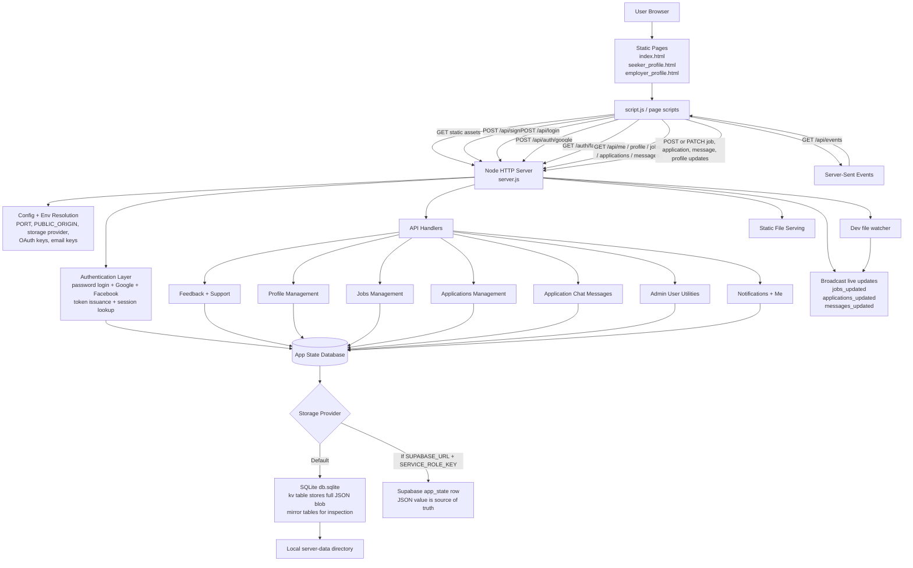

# HireUp System Flowchart



## Reset / Maintenance Flow

```mermaid
flowchart TD
    A[node tools/reset-db.js] --> B[Parse CLI args<br/>--role all|employer|seeker<br/>--accounts-only]
    B --> C[Resolve storage path<br/>server-data/db.sqlite]
    C --> D[Ensure SQLite + kv table exist]
    D --> E[Read JSON app-state from kv row]
    E --> F[Create backups<br/>timestamped JSON + SQLite copy]
    F --> G{Reset scope}
    G -->|accounts-only| H[Clear users + sessions]
    G -->|role=all| I[Clear users, sessions, jobs,<br/>applications, feedback]
    G -->|role=employer| J[Remove employer users,<br/>their sessions, jobs, applications]
    G -->|role=seeker| K[Remove seeker users,<br/>their sessions, applications]
    H --> L[Write updated JSON blob back to kv]
    I --> L
    J --> L
    K --> L
    L --> M[Rebuild readable mirror tables]
    M --> N[Print backup and reset summary]
```

## High-Level Reading

- Frontend is mostly static HTML + large client-side JS.
- `server.js` is the single backend entry point for static hosting, auth, APIs, and SSE.
- The real database is one JSON document stored in SQLite or Supabase.
- SQLite mirror tables exist mainly for inspection and maintenance tooling.
- `tools/reset-db.js` safely backs up state before clearing selected records.
